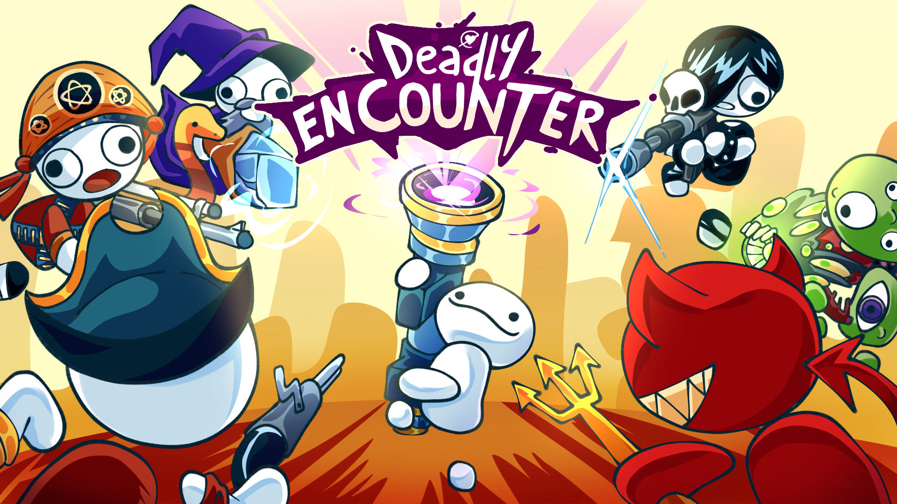

# Deadly Encounter



[](https://love2d.org/)

This is game was made for the [LÖVE JAM 2026](https://itch.io/jam/love2d-jam-2026) by _Conway USP_. This is also our first Game Jam ;)

Deadly Encounter is a fast-paced 007-game, where you encounter six enemies, each more deadly and unpredictable then the previous. You will have a short amount of time to react &mdash; either _recharge_ your bullets, do a simple _attack_, prepare a _defense_ or _heavy attack_. If you get lucky you can even _counter_ their movements. Between sessions, you can acquire items and upgrades to help you with the fight. Can you survive this **deadly encounter**?

## Install

### Pre-requisites
- Lua 5.4+
- LÖVE 2D 11.5+

### Steps

1. Simplily clone this repository and enter in the folder

```sh
git clone https://github.com/ConwayUSP/Deadly-Encounter.git
cd Deadly-Encounter
```

2. Run the game using `love`.

```sh
love .
```

## Assets & Credits

All visual art assets (characters, environments, UI, icons, etc.) were created by the Deadly Encounter team specifically for this project.

All audio assets (sound effects and music) were sourced from libraries with appropriate licenses and were edited/adapted to fit the game. Below is a detailed list of the sound effects used and their authors/licenses:

- Victory and Defeat Soundbites by Quazy1 -- https://freesound.org/s/778560/ -- License: Attribution 4.0
- Bell 03 OS by Sadiquecat -- https://freesound.org/s/791477/ -- License: Creative Commons 0
- Select Sound by Tony_Cannoli -- https://freesound.org/s/801081/ -- License: Creative Commons 0
- Select 2.wav by NIKOS34 -- https://freesound.org/s/656394/ -- License: Creative Commons 0
- Buy or Sell Item 2 by Sabacky -- https://freesound.org/s/766070/ -- License: Attribution 4.0
- Flash bang in war by TheHiddenVoice -- https://freesound.org/s/222063/ -- License: Attribution NonCommercial 3.0
- Drinks can opening 1.wav by craigglenday -- https://freesound.org/s/517175/ -- License: Creative Commons 0
- Liquid Drink .mp3 by SilverIllusionist -- https://freesound.org/s/411172/ -- License: Attribution 4.0
- PotionDrinkLONG.wav by Jamius -- https://freesound.org/s/41529/ -- License: Attribution 4.0
- Scrap metal dropping / crashing by SamsterBirdies -- https://freesound.org/s/587443/ -- License: Creative Commons 0
- menu.wav by wi-photos -- https://freesound.org/s/480932/ -- License: Creative Commons 0
- Man vomit or get hurt by Piement_infernal -- https://freesound.org/s/772689/ -- License: Creative Commons 0

## Authors 
- Aika
- Caique Costa ([@ccostafrias](https://github.com/ccostafria)) 
- Caio Bernardo ([@caio-bernardo](https://github.com/caio-bernardo))
- João Gabriel ([@jonyski](https://github.com/Jonyski))
- Letícia Sati

## Acknowledgement

All visual art assets were made by our team. Audio assets were created by external authors and are used under the licenses listed in the "Assets & Credits" section above. The idea of the project was adapted from a previous project made in C. We assume all authorship over the source code of this project.

## License

This project is under the MIT license. For more info see [LICENSE](LICENSE).
